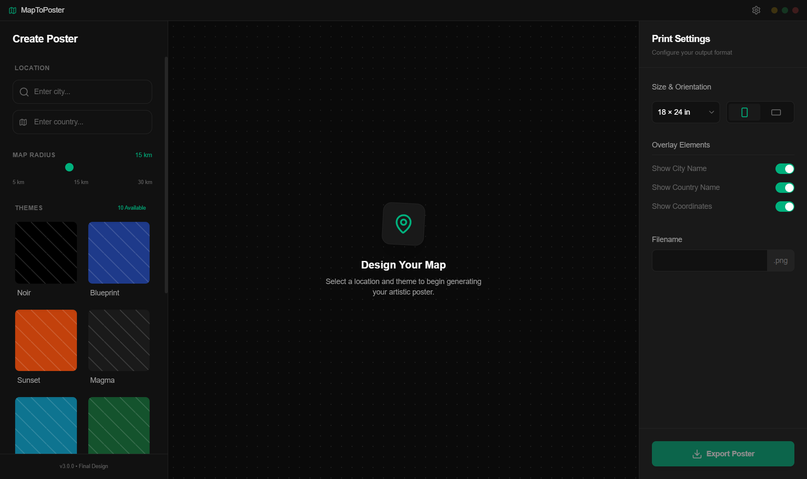

# MapToPosterGUI 🗺️

[](https://github.com/msamuslim101/maptopostergui)
[](LICENSE)
[]()
[]()

A premium, open-source desktop application for generating beautiful city map posters. Built with **Wails (Go + React)** for a lightweight, native Windows experience.

> **Made with ❤️ by [msamuslim101](https://github.com/msamuslim101)**

---

## 📸 Screenshot



---

## ✨ Features (v1.0)

- **Global Coverage**: Generate high-resolution map posters for *any* city in the world
- **10 Premium Themes**: Noir, Blueprint, Sunset, Midnight Blue, Ocean, Forest, Terracotta, Copper, Japanese Ink, Neon Cyberpunk
- **Customizable Overlays**: Toggle city name, country name, and coordinates
- **Adjustable Map Radius**: 5km - 30km for perfect framing
- **Multiple Print Sizes**: 18×24", 24×36", 12×16", A3, A2
- **Portrait & Landscape**: Orientation support
- **Native Experience**: Lightweight (~15MB app), Low RAM (~80MB idle)

---

## 📥 Download & Install

### For Users (No Coding Required)

1. **Download** the latest release from [Releases](https://github.com/msamuslim101/maptopostergui/releases)
2. **Extract** the ZIP file
3. **Run** `MapToPoster.exe`

**Folder Structure (Required):**
```
MapToPoster/
├── MapToPoster.exe      ← Run this!
└── python/
    └── server.exe       ← Backend (DO NOT DELETE)
```

> ⚠️ **Important**: Keep both files together. The app won't work without `python/server.exe`.

### System Requirements
- Windows 10/11 (64-bit)
- ~200MB disk space
- Internet connection (for downloading map data)

---

## 🙏 Attribution & Upstream

This project is a **desktop GUI wrapper** for [originalankur/maptoposter](https://github.com/originalankur/maptoposter).

| Aspect | Detail |
|--------|--------|
| **Core Engine** | [originalankur/maptoposter](https://github.com/originalankur/maptoposter) |
| **Snapshot Version** | January 18, 2026 |
| **What I Added** | Windows desktop GUI, React UI, FastAPI server wrapper, one-click installer |
| **License** | MIT (same as original) |

> 💡 All map generation logic belongs to the original project. I only added the GUI wrapper and bundling.

---

## 🚧 Roadmap (Planned Features)

### UI Components (Coming Soon)
- [ ] Custom city display name (`--name` parameter support)
- [ ] Dynamic font sizing for long city names
- [ ] Custom color picker for themes
- [ ] Live preview while adjusting settings
- [ ] Map drag-to-pan for precise positioning
- [ ] Zoom controls on map preview
- [ ] Progress bar during generation
- [ ] History/Gallery of generated posters

### Backend Features (Planned)
- [ ] Aspect ratio options (Instagram Stories 9:16, A4 print, etc.)
- [ ] Batch generation (multiple cities at once)
- [ ] Vector export (SVG/PDF) for print shops
- [ ] Custom text labels (beyond city/country name)
- [ ] Water-only mode (for coastal cities)
- [ ] Road hierarchy customization
- [ ] Cache management (clear/view cached cities)
- [ ] New themes from upstream

### Platform Support (v2.0)
- [ ] macOS support (Wails supports it!)
- [ ] Linux support

---

## 🛠️ For Developers

### Prerequisites
- **Go** 1.21+ ([download](https://go.dev/dl/))
- **Node.js** 18+ ([download](https://nodejs.org/))
- **Python** 3.11+ ([download](https://python.org/))
- **Wails CLI**: `go install github.com/wailsapp/wails/v2/cmd/wails@latest`

### Development Setup

```powershell
# 1. Clone the repo
git clone https://github.com/msamuslim101/maptopostergui.git
cd MapToPoster

# 2. Build Python backend
cd backend
python -m venv .venv
.\.venv\Scripts\activate
pip install -r requirements.txt
pyinstaller server.spec
Copy-Item "dist\server.exe" "..\wails-app\python\server.exe"

# 3. Run in dev mode
cd ..\wails-app
wails dev
```

### Production Build

```powershell
cd wails-app
wails build
# Output: build/bin/MapToPoster.exe
# Copy python/server.exe to build/bin/python/server.exe
```

---

## 🏗️ Architecture

```
MapToPoster/
├── wails-app/              # 🚀 Wails Desktop App
│   ├── app.go              # Go backend + Python sidecar management
│   ├── frontend/           # React UI (TypeScript + Tailwind)
│   └── python/             # Bundled server.exe
├── backend/                # Python FastAPI server
│   ├── server.py           # REST API for map generation
│   └── server.spec         # PyInstaller config
├── maptoposter-main/       # Core engine (osmnx + matplotlib)
└── assets/                 # Screenshots and media
```

**Tech Stack:**
- **Frontend**: React 18 + TypeScript + Tailwind CSS
- **Desktop**: Wails v2 (Go + WebView2)
- **Backend**: FastAPI + OSMnx + Matplotlib
- **Bundling**: PyInstaller (Python) + Wails CLI (Go)

---

## 📂 Data Storage

| Data Type | Location |
|-----------|----------|
| Generated Posters | Temporary folder (until you save) |
| OSMnx Map Cache | `%LOCALAPPDATA%\osmnx\` |
| App Settings | Not yet implemented |

> 💡 **Tip**: The OSMnx cache persists between sessions. Generating the same city again will be much faster!

---

## 🐛 Known Issues

- Schema warning in IDE (`Unable to load schema from wails.io`) - Safe to ignore, doesn't affect builds
- First-time generation for a new city takes 30-60 seconds (downloading map data)

---

## 📄 License

MIT License - Free for personal and commercial use.

| Component | Author | License |
|-----------|--------|--------|
| Core Map Engine | [Ankur Gupta](https://github.com/originalankur/maptoposter) | MIT |
| Desktop GUI Wrapper | [msamuslim101](https://github.com/msamuslim101/maptopostergui) | MIT |

See [LICENSE](LICENSE) for full text.

---

## 🤝 Contributing

Contributions are welcome! Please feel free to submit a Pull Request.

1. Fork the repo
2. Create your feature branch (`git checkout -b feature/AmazingFeature`)
3. Commit your changes (`git commit -m 'Add some AmazingFeature'`)
4. Push to the branch (`git push origin feature/AmazingFeature`)
5. Open a Pull Request
